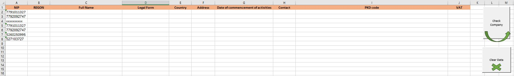
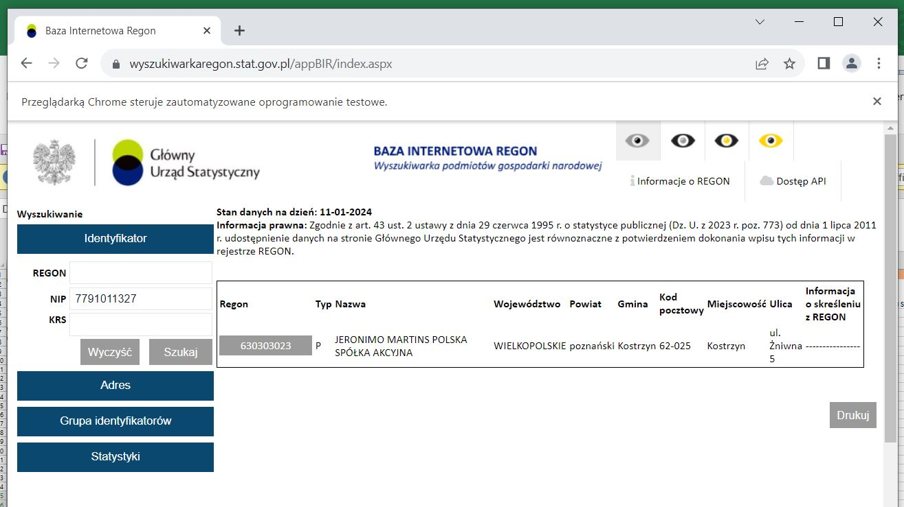
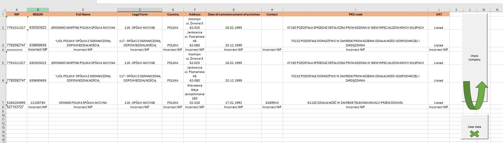

## Check Company by TIN (taxpayer identification number)

Check company is a project created in Excel using VBA (Visual Basic for Applications).

A project prepared to retrieve company data from online available registers. Based on TIN, the program checks company data such as REGON, full name, legal form, country, address, start date, contact and PKD code. The data is downloaded from the website 
"https://wyszukiwarkaregon.stat.gov.pl/appBIR/index.aspx". The second step is to verify the company's presence in the VAT register at "https://www.podatki.gov.pl/wykaz-podatnikow-vat-wyszukiwarka" . The solution automates data verification and reduces possible errors.
 

To use the solution, download the WebScrapingCompany.xlsm file, check References.  Solution prepared using Selenium. Selenium Type Library should be added to the reference.

## How it works?

Complete the necessary data for verification, namely TIN.
 

Run the macro by clicking on the "check company" button.
 

The script uses Selenium. Selenium is a tool that allows, among other things, web scraping.
 

The script will retrieve company data from both sides, filling in the fields in Excel accordingly.

If the TIN is not correct, the message 'Incorrect NIP' will appear.
 

